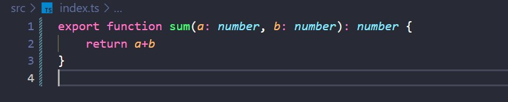
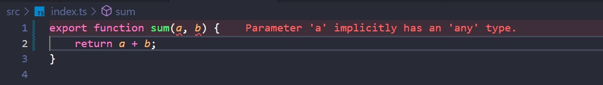
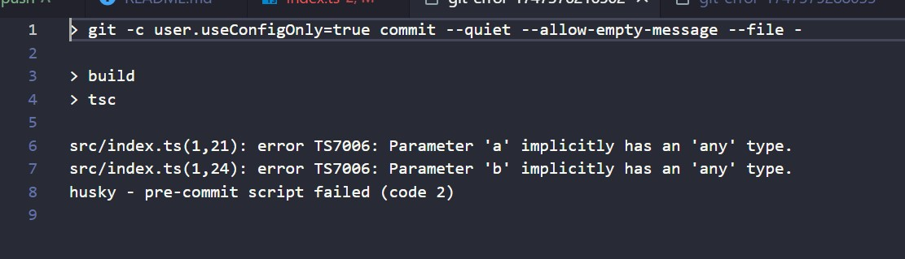
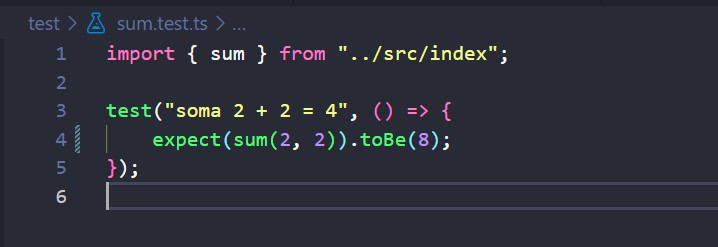
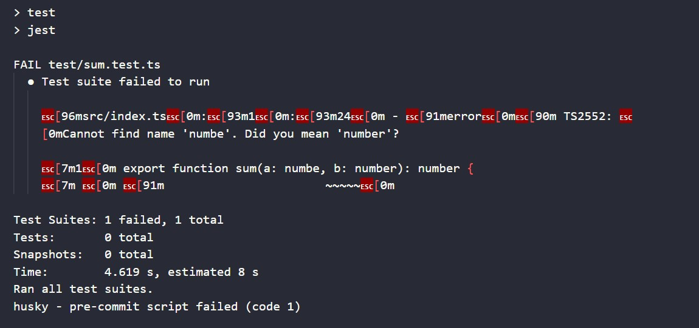

# Relatório de Configuração Husky

Ferramentas que automatizam tarefas recorrentes, como verificação de estilo de código e execução de testes, ajudam a reduzir erros humanos e aumentam a confiabilidade do projeto, qualidade de software e produtividade da equipe. O Husky é uma biblioteca que facilita a criação de hooks, ou seja, scripts que são executados automaticamente em momentos específicos, como antes de um commit ou push. Isso serve para garantir que certas ações vão ser feitas obrigatoriamente, como compilar o código ou executar testes antes que ele vá para o repositório remoto. 

Os hooks utilizados para a ponderada são:

- **Pre-commit**: é executado antes de um commit ser concluído. Neste repositório, o hook foi usado para executar a compilação do TypeScript, o que tenta evitar que um código quebrado seja versionado.
  
- **Pre-push**: é executado antes de um push para o repositório remoto. Neste repositório, o hook foi usado para rodar todos os testes automatizados, o que garante que todo código passou pelas validações obrigatórias e que nenhuma outra parte do código parou de funcionar por conta das novas mudanças.

## Etapas da Configuração

### Inicialização do projeto

Inicializei um projeto Node, que utiliza Typescript como linguagem, ESLint para padronização do código, Jest para testes automatizados e Husky para configuração dos hooks Git. Ao instalar essas dependências, o Husky cria automaticamente a pasta `.husky` no diretório raiz do projeto, onde ficam os scripts dos hooks. 

### Configurações de hooks

#### Pre-commit
No hook de pre-commit, configurei para rodar o comando "npm run build", que chama o script `tsc` do package.json e compila os arquivos na pasta `dist/`. Além disso, também foi adicionado o comando "npm run lint", que chama o script `eslint`para verificar se código segue as regras de estilo definidas. Durante a execução do comando, o Husky verifica se houve algum erro de compilação ou lint, se houver, o commit não é realizado. 

Para testar isso, foi utilizado um código base que deveria somar dois números, mas propositalmente foram inseridos erros, abortando o commit. 

<figure style="text-align: center;">
  <figcaption>Função base</figcaption>
  
</figure>

Para causar a falha no step d build, foram retiradas a tipagem dos números, o que gerou o erro de compilação no código: `parameter 'a' implicitly has an 'any' type`.
<figure style="text-align: center;">
  <figcaption>Função base</figcaption>
  
</figure>

<figure style="text-align: center;">
  <figcaption>Erro de build</figcaption>
  
</figure>

Para causar a falha no step do lint, foi adicionada uma váriavel `result` que não é utilizada, o que gerou o erro: `error 'result' is assigned a value but never used`.

<figure style="text-align: center;">
  <figcaption>Erro no lint</figcaption>
  
</figure>

#### Pre-push
No hook de pre-push, configurei para rodar o comando "npm test", que chama o script `jest` do package.json e executa os testes automatizados. Caso qualquer teste falhe, o push não é realizado, o que colabora pra manter um código funcional em todo o repositório do projeto. Para realizar o teste, foi modificada a função de teste, colocando um valor incorreto como esperado.
<figure style="text-align: center;">
  <figcaption>Teste com valor incorreto</figcaption>
  
</figure>

<figure style="text-align: center;">
  <figcaption>Erro no teste</figcaption>
  
</figure>

